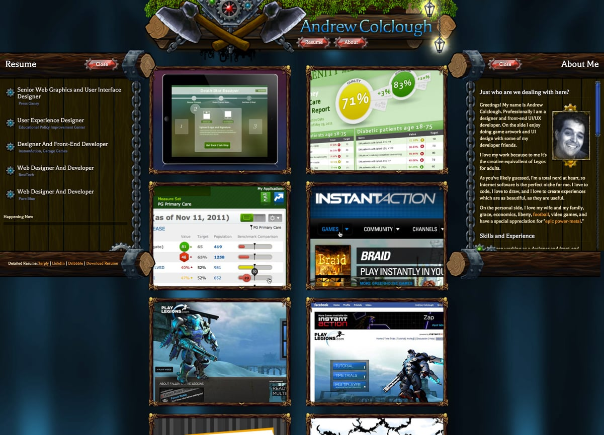

Blabbity blah blah -- who gives a rip, really.

<figure class="floatRight">

<figcaption>Hello, self</figcaption>
</figure>

## Alright - probably true, but really...

My name is Andrew Colclough, and I am a UI designer, developer, and illustrator living in Austin Texas. I graduated with a degree in _multimedia design_ from the University of Oregon in 2005 and have been designing and building web software and applications ever since. I have worked on applications for the Health Care, Education, Gaming, and E-commerce industries.

Here is [my resume](https://docs.google.com/document/d/1PfFxQgbXlFGRd_xbFDfXSMPG8BSVwuSlZfKVpsGmPkw/edit?usp=sharing), and my work history is also available on [LinkedIn](https://www.linkedin.com/in/andrewdc).

### Technical Specialties

* I enjoy working with modern JS frameworks such as _React_ and _Angular_. 
* I am a _huge_ proponent of building _Design Systems_ of UI components to support organizations. 
* I believe in a modular/object based approach to building CSS and HTML. Read about [that here](../objects-in-space/).

Along with my design and development experience, I spent a great deal of my education learning traditional drawing and painting. Recently I have returned to my illustration roots because it is and something I also love doing. Though I have experience creating artwork digitally, I have found using traditional tools such as ink and watercolor to be a nice compliment to my digital and software work.


<h2 class="recent-header"><span>About This Site</span></h2>

This site is built with [Gatsby](https://github.com/gatsbyjs/gatsby), which is a static site tool built with the new-school hottness of React and Webpack. My goal was to have total control of my site if I wanted it, but also something that got out of my way when I just wanted to create and publish content. 


_Isn't that code beautiful?_

All I need to do to publish new content is to `build` and run `ghp`, an alias for: 

```
git subtree push --prefix public origin gh-pages
```

In this way, my 'cms' is whatever editor I love best (currently Atom or Vim). Sweet.

In fact, if you like, you are welcome to check out my code here: [http://github.com/andrewdc/adc](http://github.com/andrewdc/adc)

My automatically generated changelog can be found here: [CHANGELOG.md](https://github.com/andrewdc/adc/blob/master/CHANGELOG.md)

<h2 class="recent-header"><span>History Museum</span></h2>

### andrewdc 1.0

The first rendition of this site was built with Wordpress and looked like this. 


### andrewdc 2.0

Several years later I came up with version 2.0, which was a static site, generated with a framework called [Ruhoh](http://ruhoh.com/).



I had way too much fun creating  version 2.0. Drawing all of the illustrative elements was a total blast. I mean, why have a boring footer, when you could have:


The 2.0 design carried a huge amount of my personality (obviously, I _hate_ video games. Wait...what?), however I believe it was weak in it's overall purpose. Looking at this now, I think the same feeling could have been conveyed in a less direct way.
