In 2005, I graduated with a degree in multimedia design from the University of Oregon. I was trained in traditional design, but I always had a deep interest in web development. Over the years, I have spent the bulk of my career working between the two disciplines. I like to say:

>"I design with code."

I am heavily involved in front-end development and architecture, and have a lot of experience working with modern Javascript frameworks such as Angular, and React.

I am also a huge proponent of modular (or component) design architectures, which I [have written about](https://medium.com/objects-in-space/objects-in-space-f6f404727#.u7nezzji9), and given talks. I have worked to help direct several organizations in constructing design systems based on these principals.

Here is [my resume](https://docs.google.com/document/d/1PfFxQgbXlFGRd_xbFDfXSMPG8BSVwuSlZfKVpsGmPkw/edit?usp=sharing), and my work history is also available on [LinkedIn](https://www.linkedin.com/in/andrewdc).

<h2 class="recent-header">Design Systems</h2>

### PowerSchool Design System

A pattern and component library being built from the ground up. 

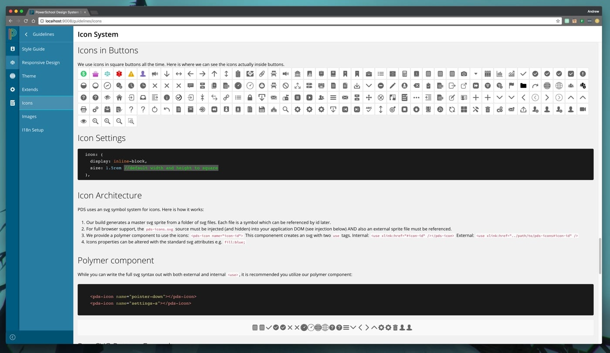

I was tapped, along with two other developers to build a company-wide design system for PowerSchool. It is a component library built with Sass, Angular 2, and Polymer, and consumed by several applications. 

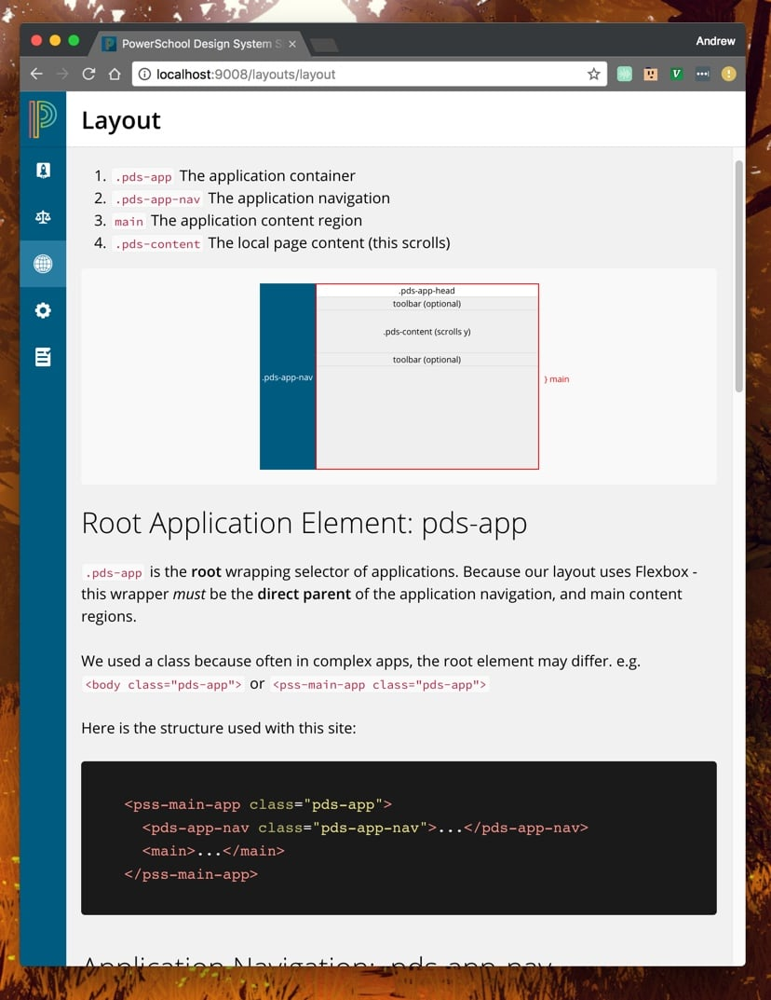

The system utilizes a flexible theme system, where we can provide the base design for the organization, but also allow each team the flexibility to customize and extend the library to fit their application's unique needs. 

### nxsass for InComm Digital Solutions

I teamed up with another designer to build a modular Sass design system.
 
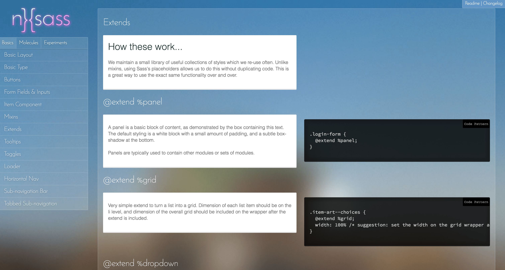

Nxsass allowed us to create and support several teams and applications across our organization. Also, we had a great area for prototyping user interface designs.

**A Time Picker Concept**
 
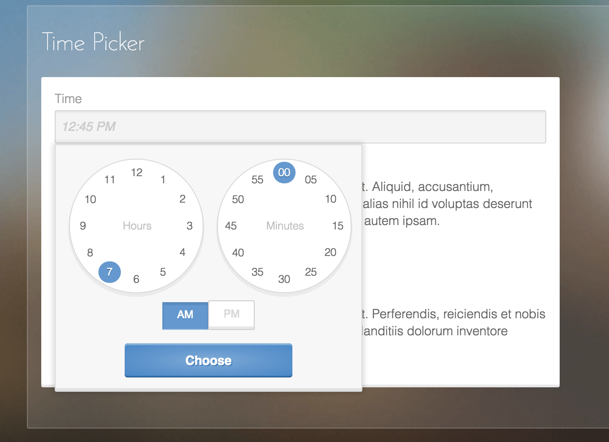

<h2 class="recent-header">User Interfaces</h2> 

My specialty and experience bridges the gap between designer and developer. When I have been the sole designer at an organization, I end up wearing all hats: e.g. sketching UI concepts, to hi-rez comps, to production coding. Other times, I have worked on a design team, and will usually focus more on front-end coding aspects and architecture.

  [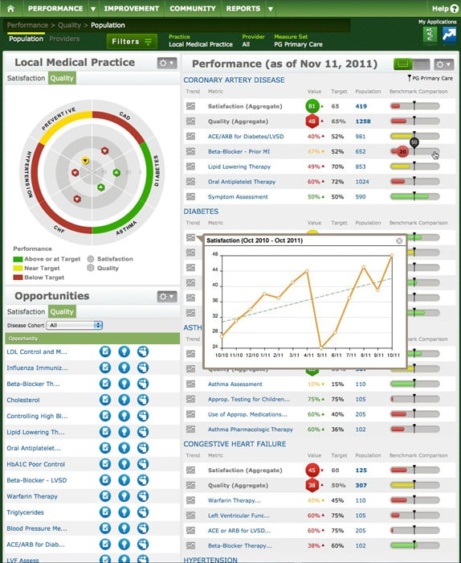](../../assets/prac-perf-full.jpg)
  [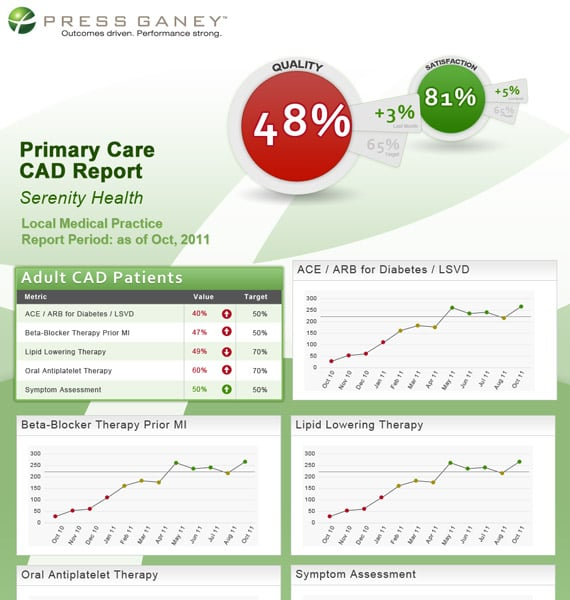](../../assets/pp-report-full.jpg)
  [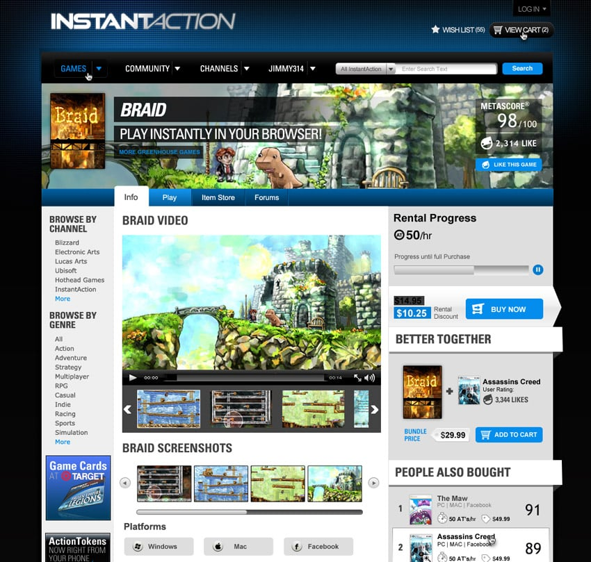](../../assets/ia2-full1.jpg)
  [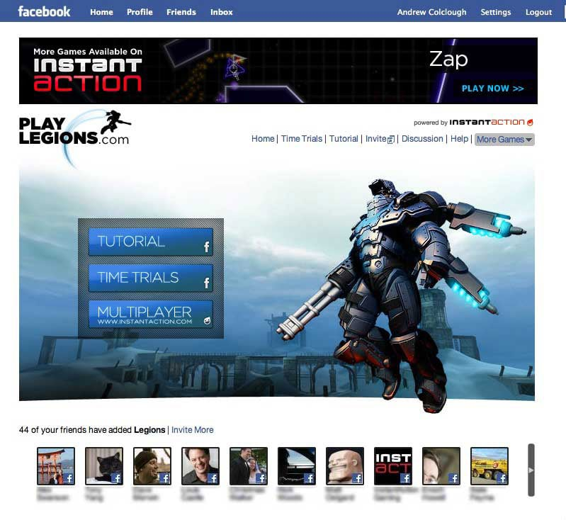](../../assets/fblegions-full.jpg)
  [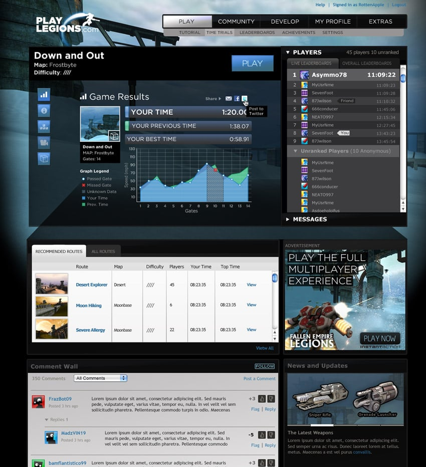](../../assets/legions-full.jpg)
  [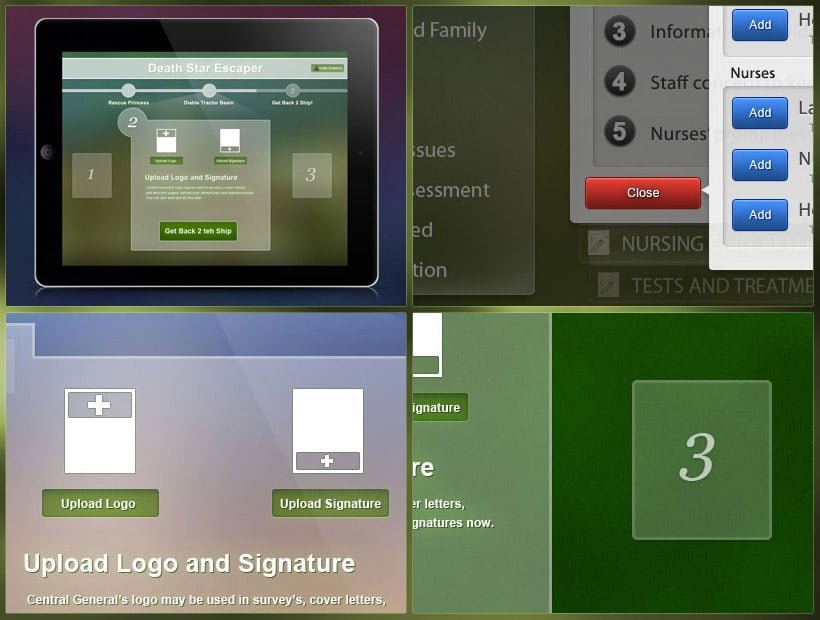](../../assets/ipad-full.jpg)
  
  [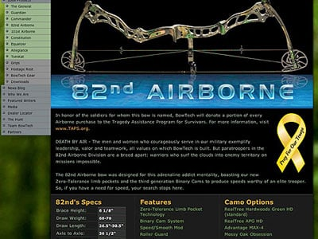](../../assets/bowtech.jpg)
  [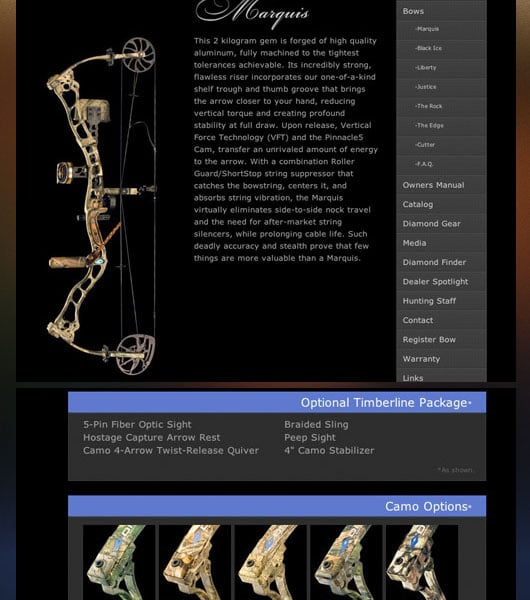](../../assets/bowtech-full.jpg)
  [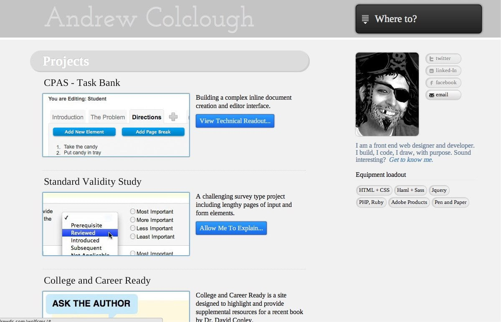](../../assets/minimal-full.jpg)
